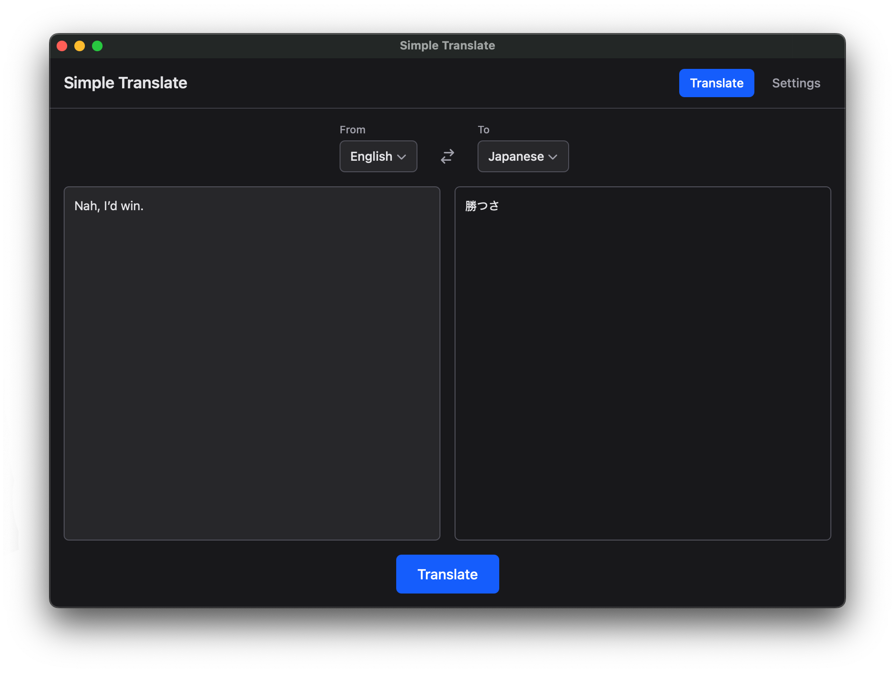

<h1>
<p align="center">

<br>Simple Translate
</p>
</h1>
<p align="center">
A lightweight desktop translation app built with Tauri, React, and the OpenAI API.
<br />
<a href="https://github.com/jswent/simple-translate/releases/latest">Download</a>
</p>



## Features

- Real-time streaming translations
- Support for 20+ languages
- Customizable system prompts
- Multiple GPT model options
- Dark mode support
- Cross-platform (macOS, Windows, Linux)

## Model Providers

Currently only supports **OpenAI API**. You will need an OpenAI API key to use this application.

Support for additional providers (Anthropic, local models, etc.) may be added in future releases.

## Development

### Prerequisites

- [Node.js](https://nodejs.org/) (LTS)
- [pnpm](https://pnpm.io/)
- [Rust](https://rustup.rs/)

### Setup

```bash
# Install dependencies
pnpm install

# Run in development mode
pnpm tauri dev

# Build for production
pnpm tauri build
```

## Configuration

1. Open Settings in the app
2. Enter your OpenAI API key
3. Select your preferred model and default languages

## License

MIT
